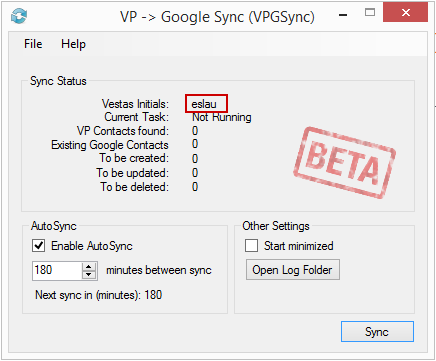
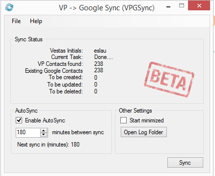

# Welcome to the VP->Google Sync (VPGSync) client.

This project is only intended for people working at Vestas Wind Systems

It is a synchronization tool for the internal VP (Vestas People) tool and to your personal Google Contacts. It is a one-way sync, hence only add/update/delete contacts in Google.

My internal initials are ESLAU if you need to get in contact with me.

**DISCLAMER - This is not the work of Vestas, this is just me as a private person, no one has approved or asked me to do it..**
**I’m doing it on my own free time, so if you use the software you are on your own, no creating tickets to IT Service, nor expecting me to help you out you are on your own**

## It does what?!?

It will download all contacts in the VP-DB that is marked for synchronization and add that to your Google Contacts.

All contacts in Google will have the label/group of "VPGSync". 

This will trigger an update..

* New VP Person is marked to be sync'ed -> Contact is created in Google
* VP Person is updated centrally (from SAP) -> Contact is updated in Google
* Google Contact is changed -> VP Person will overwrite your Google Contact
* VP Person leaves Vestas (changes status as former employee) -> Contact is deleted in Google Contact
* Sync mark removed on VP Person -> Contact is deleted in Google Contact.

This tool will only touch any Google Contact in the group/label "VPGSync"
This tool CANNOT update any VP Contact/Person..

## Why?

The Outlook App.. I hate it, like really really hate it.. But I am forced to use it, like really really forced to use it.

I cannot believe that M$ get away with pushing such s... to people, damn..

I can only mark one person at a time to me synced and it keeps fu..... up my contacts on my phone..

So I finally got so annoyed and decided to do something about it.

## Where to download?

You can get it from here: https://github.com/hyberdk/VPGSync/releases/tag/v0.1

## What works?

* VP People marked for "Outlook synchronization" will be synced
* VP Departments marked for "Outlook synchronization" will be sync
 - Only the Department will be synced, not parent- or sub-departments will synchronize.
 - You can mark as many departments as you like.

## What is synchronized?

From VP field | | To Google field
--------- | --- | ---------
Signature | --> | Nickname
Telephone | --> | Work Phone
Mobile telephone | --> | Work Mobile
Private mobile telephone | --> | Private Mobile
Department | --> | Company
Position | --> | Job Title
E-mail | --> | Work Email
Private E-Mail | --> | Private Email

## Okay, so what does not work?

Probably a lot.. like a lot..

But known outstanding is:

* Sites marked to be synchronized
* Picture is not uploaded to Google Contacts

and you know, this was thrown together in 7-8 evenings, so not much error handling or logging is done.. So it will probably crash for you at some point.

# How to use VPGSync #

here is a quick guide to use it.

## Marking/Removing contacts for syncronization in VP ##

Go to http://vp

Find the contact/department you want to add/remove to your Google Contact and press the "Outlook synchronization"

#### Add Person ####

#### Remove Person ####
 

#### Add Department ####

#### Remove Department ####
 

## Start Sync ##

#### Start the program ####
Execute the VPGSync.exe file (you do not need to be administrator to run it)

The main window will appear

**It is important that your initials are shown correct**

**AND you must be connected to the internal network, either in an office or via VPN**

When you are ready... Hold your breath and hit "Sync"

## Authorize Google Contact Access (first time only)

First time you synchronize on your PC it will ask you to confirm that the program can read/modify your contacts. Afterwards we will use a "Refresh Token" that does not require your involvement. You can always revoke the "Refresh Token" from your Google Account

A browser will pop up and ask you to log in:

I use my personal account, you select the one you like to use.

Now allow VPGSync to read your contacts by hitting the "ALLOW" button

Once that is done, the focus will return to the VPGSync application..

## Syncing ##
While the application is running you can see the progress on how many contacts it found in VP, how many in Google, how many to create, update or delete.

You will see the numbers reflect the status of the sync.

Once its done it will look something like this:

You can now see your contacts in Google

Verify by visiting the https://contacts.google.com and check the "VPGSync" group

**THAT IT FOLKS!**

If you want to update, just hit the "Sync" button again.. ;-)

# Revoking access to Google # 

5 - steps, here we go:

Login to Google and go to "My Account"

Click "Apps with account access"

Click "MANAGE APPS"

Click the "VP->Google Sync (VPGSync)" app and then click "REMOVE ACCESS"
